<!-- ===================== HERO ===================== -->

  

<table>
<tr>
<td width="34%" valign="top">

### 👋 Profile

**Data Scientist** focused on practical AI and data-driven systems.

📍 Islamabad, Pakistan  
🎓 B.Sc. Computer Science  
💼 Data Science / ML / DL  
🔬 Research-oriented AI development

</td>
<td width="33%" valign="top">

### 🧠 Core Focus

- Machine Learning
- Deep Learning
- NLP & LLMs
- Computer Vision
- AI Agents
- Data Analysis & Visualization

**Workflow:**  
Explore → Model → Evaluate → Deploy

</td>
<td width="33%" valign="top">

### 🚀 Current Direction

Building a stronger research foundation in:

**AI · ML · NLP · LLMs · Multi-Agent Systems**

Interested in reproducible experiments, practical AI applications, and research-driven development.

</td>
</tr>
</table>

  
  

  
  
  
  

  ◈ DATA • MODELS • INTELLIGENCE ◈

---

## 🧠 About Me

<table>
<tr>
<td width="58%" valign="top">

I'm a **Data Scientist** focused on building practical solutions across:

- 🤖 Machine Learning & Predictive Modeling
- 🧠 Deep Learning & Neural Networks
- 💬 NLP, Sentiment & Emotion Analysis
- 👁️ Computer Vision
- ✨ LLMs & AI-Agent Concepts
- 📊 Data Analysis, Visualization & Feature Engineering

I enjoy taking a problem from **raw data → exploration → modeling → evaluation → application**.

**Current direction:** strengthening my research foundation in **AI, ML, NLP, LLMs and multi-agent systems** while building reproducible, portfolio-ready projects.

</td>
<td width="42%" align="center">

  

</td>
</tr>
</table>

---

## ⚡ Tech Stack

  

  

  
  
  

---

## 🚀 Featured Work

<table>
<tr>
<td width="50%" valign="top">

### 🎬 StarGazer
**Genre-Specific Movie Recommendation System**

Recommendation system combining movie information with **sentiment and emotion analysis**.

**Focus:** NLP · Recommendation Systems · Sentiment Analysis · Emotion Analysis · Explainable AI

</td>
<td width="50%" valign="top">

### 🖼️ CNN Image Classification
**Image Classification Using CNN**

Computer-vision study comparing neural-network approaches for image classification.

**Focus:** Computer Vision · CNN · TensorFlow · Model Evaluation

</td>
</tr>

<tr>
<td width="50%" valign="top">

### 💼 Salary Prediction
**Data Science Salary Prediction**

End-to-end workflow covering collection, cleaning, EDA, feature engineering, ML modeling and Flask API deployment.

**Focus:** ML · Feature Engineering · Web Scraping · Flask

</td>
<td width="50%" valign="top">

### 🚀 SpaceX Falcon 9
**Landing Prediction**

IBM Data Science capstone applying data collection, EDA, SQL, visualization and machine learning.

**Focus:** Data Science · SQL · EDA · Machine Learning · Visualization

</td>
</tr>

<tr>
<td width="50%" valign="top">

### 🏸 Badminton Analysis
Data-driven analysis and visualization of badminton game data.

**Focus:** EDA · Data Analysis · Visualization · Insights

</td>
<td width="50%" valign="top">

### 🌾 Agricultural Optimization
Data analysis project exploring agricultural production and optimization.

**Focus:** Data Analysis · Visualization · Optimization

</td>
</tr>
</table>

---

## 📊 GitHub Analytics

<table align="center">
<tr>
<td width="42%" valign="top" align="center">

</td>
<td width="58%" valign="top">

### 🐍 Languages & Tools

**Jupyter notebooks:**  

 

**Also used across projects:**

  
  
  
  
  
  
  
  
  
  
  
  
  
  
  
  
  

</td>
</tr>
</table>

  

---

## 💼 Experience

**Data Scientist — SleepLiveWell**  
October 2024 – March 2025

- Analyzed sleep-related datasets for predictive modeling.
- Developed AI-agent solutions using TensorFlow and NLP.
- Performed feature engineering to improve model quality.
- Collaborated on data-driven sleep-health solutions.
- Worked with YAML and LLM concepts for deployable AI-agent workflows.

---

## 🎓 Education

**Bachelor of Science in Computer Science**  
Abasyn University, Peshawar

---

## 🏆 Highlights

  
  
  

- IBM Data Science professional learning
- IBM Machine Learning professional learning
- Undergraduate project: *Genre-Specific Movie Recommendation System Using Sentiment and Emotion Analysis*
- University final-year project / thesis open-defense winner

---

## 🔬 Research Interests

  
  
  
  
  
  

---

## 📈 Contribution Pulse

  

  Updated automatically every 12 hours by GitHub Actions.

---

## 🤝 Let's Connect

  
  
  

  <i>Building practical AI systems from data, one project at a time.</i>

  

